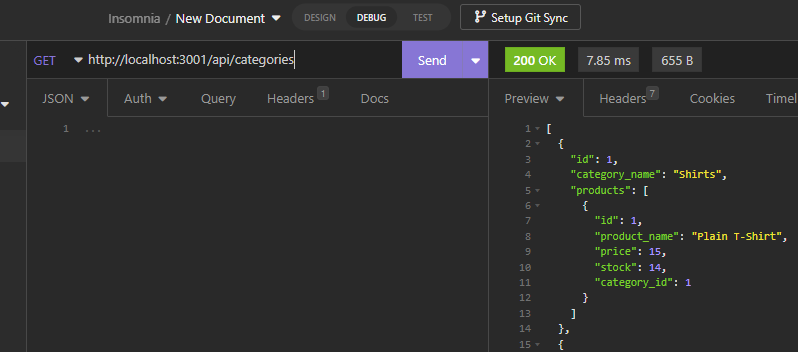

# e-commerce

## Table of Contents
[Description](#description) 
[Requirements](#requirments) 
[Usage](#usage) 
[Screenshot](#screenshot) 
[Video](#video) 
[Access](#access) 
[Credits](#credits) 
[Roadmap](#roadmap) 
[Questions](#questions) 
[License](#license)

## Description
 The motivation for this project was to create the back end for an e-commerce company. This will assist managers of an internet retail company by allowing them to track their inventory using the latest technologies. This way they will be able to compete with other e-commerce companies.

## Usage
App is to be used to help view and manage a database of product information. Dependencies need to be installed with npm i from the terminal.
Add a .env file with: 
DB_NAME='ecommerce_db'
DB_USER='your user name: Default: root'
DB_PASSWORD='Your Password'
Then the user will need to create the e-commerce database. This is done my running "mysql -u root -p" in the console, entering the user's SQL password, and running "source db/schema.sql" in the terminal. The user can then exit mysql. The user must then seed the database by executing the seeds file by entering "npm run seed" in the terminal. The user can then start the server using "npm run start" in the terminal. 
Insomnia browser can be used at localhost:3001/api/ to test the app.

## Requirements
MySql

## Screenshot

## Video
[Video Walkthrough](https://drive.google.com/file/d/1eyKDrpUsNOaPfeXgkb88zHF7Atir4aK9/view)

## Access

[Github](https://www.github.com/beattycharles)
[Commerce App](https://github.com/beattycharles/e-commerce)

## Credits
Special Thanks to: https://github.com/BogartDME, https://github.com/EvolanGIT, and https://github.com/difurung,
https://sequelize.org/,
https://www.geeksforgeeks.org/express-js-express-router-function/

## Questions
My Github is https://github.com/beattycharles,  
You can reach me at beattycharles@yahoo.com with any questions.;

## Roadmap
No further updates planned

## License
Copyright (c) 2022 beattycharles

Permission is hereby granted, free of charge, to any person obtaining a copy
of this software and associated documentation files (the "Software"), to deal
in the Software without restriction, including without limitation the rights
to use, copy, modify, merge, publish, distribute, sublicense, and/or sell
copies of the Software, and to permit persons to whom the Software is
furnished to do so, subject to the following conditions:

The above copyright notice and this permission notice shall be included in all
copies or substantial portions of the Software.

THE SOFTWARE IS PROVIDED "AS IS", WITHOUT WARRANTY OF ANY KIND, EXPRESS OR
IMPLIED, INCLUDING BUT NOT LIMITED TO THE WARRANTIES OF MERCHANTABILITY,
FITNESS FOR A PARTICULAR PURPOSE AND NONINFRINGEMENT. IN NO EVENT SHALL THE
AUTHORS OR COPYRIGHT HOLDERS BE LIABLE FOR ANY CLAIM, DAMAGES OR OTHER
LIABILITY, WHETHER IN AN ACTION OF CONTRACT, TORT OR OTHERWISE, ARISING FROM,
OUT OF OR IN CONNECTION WITH THE SOFTWARE OR THE USE OR OTHER DEALINGS IN THE
SOFTWARE.
